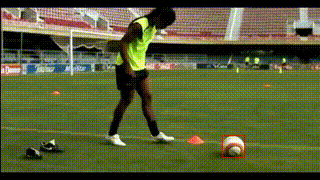

# Sashank Tirumala - AIM Take Home Assignment
# Police-Man Thief Problem
Requires Python 3+ only
```bash
cd task1
python code.py
```


## Overall Strategy
This problem is essentially solved through 2 steps
1. Checking if a particular cell is visible to a policeman. 
    1. First, we find the corners of the cell.
    2. Next, we find the angle between the corners and each policeman.
    3. Check if the angle lies within the field of view of the policeman. If it does then that cell is visible to that policeman.
2. Finding the closest cell that is not visible to any policeman is done using a Breadth First Search. We start at the thief's original position and stop at the first cell which is not visible to any policeman.  

## Edge Cases to Handle
There are numerous edge cases to handle in this question. The edge cases I handled in my code are:
1. Grid in invalid format.
2. Orientations and FOV in invalid format (>360 or < 0).
3. Multiple thiefs in the grid.
4. Multiple positions for the same policeman.
5. No policeman in grid.
6. No valid square for the thief to move to.
7. Handling contact with only the edge of the cell.

Additionally, created a few test cases to check the code.

# Ball Tracking

## Setup
1. Requires python 3.8+
2. Download YOLO weights in TensorRT format from my drive link: https://drive.google.com/file/d/1-oc-7kUV0_MDLJzanqNUG62fXyE0KSd8/view?usp=sharing and store it in `task2` folder.
3. Install required packages using pip.

    ```bash 
    pip install -r requirements.txt
    ```
4. Run the code
    ```bash 
    python predict.py
    ```
## Final Solution
1. Simple to implement: It is just outlier removal with YOLO detection. 
2. **Speed ~ 160 fps (frames per second).**
3. No spurious detections, however can miss the ball when it moves very fast or is occluded.
## Overall strategy
I first tried state of the art deep learning based methods. The state of the art architectures are the Siamese Network Trackers like SiamMask. While these methods are the state of the are in visual object tracking, they do require data to train. Since in this problem statement there was no dataset, I could not pursue these methods. Off the shelf, pretrained networks worked poorly.

Then I tried classical trackers like KCF, MedianFLOW, CSRT. However the ball actually had quite a bit of common colours with the stand, the Coco Cola sticker, the seats and the presence of occlusions caused poor performance with these classical trackers. Once they lose track of the ball in a couple of frames, they struggle to get back on track.

Finally I decided to treat this more like a detection problem and decided to use an off the shelf detection network like YOLO (You Only Look Once). This gave me great results. I decided to pursue this method, focusing on speeding up YOLO and removing spurious detections. 

## Speeding up YOLO
Original Yolo took around 33 seconds to process a video of 34 seconds. So it was barely at around 28 fps, close to real time. For production environments we can compile the YOLO into Nvidia's TensorRT format. After doing that I managed to process the video of 34 seconds in 6 seconds, leading to a speed of 168 fps or a ~5X speed up over ordinary YOLO. 
This was well beyond real time and I do not think requires any more speedup. If we quantize the model to 16 bit precision, we process the video in 4 seconds leading to around 230 fps. This however does cause a noticeable drop in accuracy. Thus, I recommend using the default 32 bit precision model for this task. 

## Removing spurious detections
The general strategy for this task is to use something like Kalman Filters. In my previous experience I have found that in many tasks, Kalman Filters can be an overkill and in fact simple alpha-beta filters and outlier detection are instead sufficient. So I first started with outlier detection. After some experimentation I came up with the following ways of detecting outliers:
1. If the bounding box was very small, area wise I removed the bounding box.
2. If the bounding box was too rectangular, I removed the bounding box.
3. If the change in the center of the ball was too drastic, I removed the bounding box.

After performing these three outlier removal steps, I eye-balled the results and it looked really good. I found no spurious detections in the video. And thus I found this video good to submit for the take home assignment

## Next steps if I had more time
It is important to stress that since I only spent a few hours on this problem, this solution is an early prototype. A few things I would change for the final solution:
1. Right now outliers are only removed. I would like to replace outliers with predictions. The predictions can be determined with a simple alpha-beta filter or a Kalman Filter depending on what works well.
2. Try implementing State of The Art Siamese Network Trackers. This would require around a 1000 labelled images and quite some data augmentation, however with this we would be able to obtain state of the art tracking results despite heavy occlusions, changes in lighting etc.

